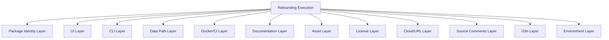

# Design Document: Audira Route Rebranding

## Overview

This design describes the systematic rebranding of the application from "9Router" to "Audira Route" across the entire codebase. The rebranding is a deterministic, one-time transformation applied to package identifiers, UI text, CLI output, data directories, Docker configuration, documentation, image assets, license attribution, cloud sync URLs, source code comments, i18n files, and environment configuration.

The approach uses a structured, category-based replacement strategy where each category of change (package identity, UI, CLI, etc.) is handled as an independent unit of work. This ensures traceability back to requirements and allows incremental verification.

### Design Decisions

1. **Case-sensitive mapping**: The old brand appears in multiple casings (`9Router`, `9router`, `9router-app`). Each maps to a specific new-brand form:
   - `9Router` → `Audira Route` (display/title case)
   - `9router` → `audira-route` (kebab-case, used in package names, CLI commands, file paths)
   - `9router-app` → `audira-route-app` (root package name)
   - `9Router` in camelCase contexts → `audiraRoute`

2. **No migration tooling for user data**: The `.9router` → `.audira-route` rename applies only to source code references. Existing user installations will need a separate migration path (out of scope for this spec).

3. **Preserve original license attribution**: The MIT license keeps the original copyright line and adds a new one below it.

4. **Atomic file renames**: Image assets are renamed in a single commit to avoid broken references.

## Architecture

The rebranding is organized into independent transformation layers, each corresponding to a requirement:

Each layer is independent and can be applied and verified in isolation. The only dependency is that the Asset Layer (H) must complete before the Documentation Layer (G) updates image references.

### Execution Strategy

The rebranding is executed as a scripted transformation with the following phases:

1. **Discovery**: Identify all files containing old brand references using grep/ripgrep
2. **Transformation**: Apply replacements per category using case-sensitive string substitution
3. **Rename**: Rename files/directories that contain the old brand in their name
4. **Verification**: Run automated checks to confirm no old brand references remain

## Components and Interfaces

### Component 1: Package Identity Transformer

**Scope**: `package.json` (root), `cli/package.json`

**Transformations**:
| Field | Old Value | New Value |
|-------|-----------|-----------|
| Root `name` | `9router-app` | `audira-route-app` |
| Root `description` | `9Router web dashboard` | `Audira Route web dashboard` |
| CLI `name` | `9router` | `audira-route` |
| CLI `description` | `9Router CLI - Start and manage 9Router server` | `Audira Route CLI - Start and manage Audira Route server` |
| CLI `bin` key | `9router` | `audira-route` |
| CLI `keywords[0]` | `9router` | `audira-route` |
| CLI `comment_sqlite` | `~/.9router/runtime/node_modules` | `~/.audira-route/runtime/node_modules` |
| CLI `comment_systray` | `~/.9router/runtime/node_modules` | `~/.audira-route/runtime/node_modules` |

### Component 2: Dashboard UI Transformer

**Scope**: `src/app/layout.js`, `src/app/login/page.js`, `src/app/landing/page.js`, `src/app/manifest.js`, and any other React components referencing the brand.

**Transformations**:
- `metadata.title`: `"9Router - AI Infrastructure Management"` → `"Audira Route - AI Infrastructure Management"`
- `manifest.name`: `"9Router - AI Infrastructure Management"` → `"Audira Route - AI Infrastructure Management"`
- `manifest.short_name`: `"9Router"` → `"Audira Route"`
- Login page heading: `"9Router"` → `"Audira Route"`
- Landing page GitHub URL: update repository reference
- All component text referencing `9Router` → `Audira Route`

### Component 3: CLI Transformer

**Scope**: `cli/cli.js`, `cli/src/cli/terminalUI.js`, `cli/src/cli/tray/`, `cli/hooks/`

**Transformations**:
- `PROCESS_IDENTIFIERS`: `['9router']` → `['audira-route']`
- `getAppDataDir()`: `".9router"` / `"9router"` → `".audira-route"` / `"audira-route"`
- Terminal UI title: `"📡 9Router Terminal UI"` → `"📡 Audira Route Terminal UI"`
- Breadcrumb base path: `["9Router"]` → `["Audira Route"]`
- Background mode message: `"9Router is now running in background"` → `"Audira Route is now running in background"`
- Process identification in `killAllAppProcesses`: match `"audira-route"` instead of `"9router"`

### Component 4: Data Path Transformer

**Scope**: All source files referencing `~/.9router` or `.9router-data`

**Transformations**:
- `~/.9router` → `~/.audira-route` (all occurrences in source code)
- `.9router-data` → `.audira-route-data` (all occurrences in source and config)
- `cli/hooks/postinstall.js`: runtime directory path update
- `src/mitm/paths.js`: `APP_NAME = "9router"` → `APP_NAME = "audira-route"`

### Component 5: Docker/CI Transformer

**Scope**: `Dockerfile`, `.github/workflows/docker-publish.yml`, `DOCKER.md`

**Transformations**:
- Dockerfile label: `org.opencontainers.image.title="9router"` → `org.opencontainers.image.title="audira-route"`
- Dockerfile symlink: `ln -sf /app/data-home /root/.9router` → `ln -sf /app/data-home /root/.audira-route`
- Workflow env: `DOCKERHUB_IMAGE: decolua/9router` → `DOCKERHUB_IMAGE: decolua/audira-route`
- `DOCKER.md`: All brand references updated

### Component 6: Documentation Transformer

**Scope**: `README.md`, `i18n/README.*.md`, `CHANGELOG.md`, `docs/ARCHITECTURE.md`, `gitbook/content/**/*.md`

**Transformations**:
- All `9Router` → `Audira Route`
- All `9router` → `audira-route`
- Badge URLs: `npmjs.com/package/9router` → `npmjs.com/package/audira-route`
- GitHub URLs: repository references updated
- Shield.io badge references updated

### Component 7: Asset Transformer

**Scope**: `images/`, `public/`

**Transformations**:
- Rename `images/9router.png` → `images/audira-route.png`
- Update all markdown image references from `images/9router.png` to `images/audira-route.png`
- Rename any public directory assets containing "9router"

### Component 8: License Transformer

**Scope**: `LICENSE`, `cli/LICENSE`

**Transformations**:
- Add line: `Copyright (c) 2025 Audira Route contributors`
- Preserve existing: `Copyright (c) 2024-2026 decolua and contributors`
- New line placed below existing line

### Component 9: Cloud/URL Transformer

**Scope**: Source files referencing cloud sync endpoints, `.env.example`

**Transformations**:
- `CLOUD_URL=https://9router.com` → `CLOUD_URL=https://audira-route.com`
- `NEXT_PUBLIC_CLOUD_URL=https://9router.com` → `NEXT_PUBLIC_CLOUD_URL=https://audira-route.com`
- Any branding text in cloud sync logic

### Component 10: Source Comments Transformer

**Scope**: All `.js`, `.ts`, `.mjs` files with comments referencing the old brand

**Transformations**:
- Comment text `9Router` → `Audira Route`
- Comment text `9router` → `audira-route`
- `User-Agent` header: `9Router/${version}` → `AudiraRoute/${version}`
- `X-CLIENT-TYPE`: `"9router"` → `"audira-route"`
- npm badge URLs in markdown
- GitHub repository URL references

### Component 11: i18n Transformer

**Scope**: `i18n/`, `gitbook/content/`, `public/i18n/`

**Transformations**:
- All `9Router` → `Audira Route` preserving sentence grammar
- All `9router` → `audira-route`
- Applied across all language directories (en, es, ja, vi, zh-CN)

### Component 12: Environment Transformer

**Scope**: `.env.example`, `captain-definition`, `start.sh`

**Transformations**:
- `.env.example` header comment: `# 9Router environment contract` → `# Audira Route environment contract`
- `.env.example` `DATA_DIR`: `/var/lib/9router` → `/var/lib/audira-route`
- `.env.example` `INSTANCE_NAME`: `9router` → `audira-route`
- `captain-definition`: no brand reference found (only `dockerfilePath`), no change needed
- `start.sh`: update any `9router` references

## Data Models

No new data models are introduced. This feature modifies existing string literals and file names only.

### Affected Data Structures

| Structure | Location | Change |
|-----------|----------|--------|
| `package.json` schema | Root, CLI | `name`, `description`, `bin`, `keywords` fields |
| Web manifest | `src/app/manifest.js` | `name`, `short_name` fields |
| HTML metadata | `src/app/layout.js` | `title` field |
| Environment config | `.env.example` | Comment text, `DATA_DIR`, `CLOUD_URL` values |
| Docker labels | `Dockerfile` | `org.opencontainers.image.title` |
| CI/CD config | `.github/workflows/` | `DOCKERHUB_IMAGE` env var |

## Error Handling

### Incomplete Replacement Detection

After applying all transformations, a verification step scans the entire codebase for any remaining old brand references. If found:
- Log the file path and line number
- Flag as incomplete rebranding
- Fail the verification check

### False Positive Handling

Some occurrences of "9router" may be intentional (e.g., in git history references, external URLs not under our control). The verification step maintains an allowlist of known exceptions:
- Git commit messages (not modified)
- External URLs pointing to third-party services (if any)
- Binary files (images are renamed, not content-edited)

### File Rename Conflicts

If a target filename already exists during asset renaming:
- Abort the rename
- Log the conflict
- Require manual resolution

## Testing Strategy

### Approach

Since this feature is a deterministic, one-time codebase transformation (not a runtime function with variable inputs), **property-based testing is not applicable**. The transformations are fixed string replacements in known files — there is no meaningful input space to randomize over.

Instead, the testing strategy uses:

1. **Verification scripts** (automated grep-based checks)
2. **Example-based unit tests** (specific file content assertions)
3. **Build verification** (ensure the application compiles and starts after changes)
4. **Visual inspection** (UI screenshots for brand consistency)

### Test Categories

#### 1. Completeness Verification (Automated)

A script scans the entire codebase (excluding `node_modules`, `.next`, `.git`) for any remaining references to:
- `9Router` (case-sensitive)
- `9router` (case-sensitive)
- `9router-app`
- `.9router`
- `decolua/9router` (Docker image)

Expected result: zero matches (or only allowlisted exceptions).

#### 2. Package Identity Tests (Example-based)

- Assert root `package.json` has `name: "audira-route-app"`
- Assert CLI `package.json` has `name: "audira-route"`
- Assert CLI `package.json` has `bin: { "audira-route": "./cli.js" }`
- Assert CLI `package.json` keywords include `"audira-route"`

#### 3. Build Verification

- `npm install` succeeds in root
- `npm run build` succeeds (Next.js build)
- CLI `node cli/cli.js --version` outputs version without errors
- Docker build completes: `docker build -t audira-route .`

#### 4. Runtime Smoke Tests

- Application starts on default port 20128
- Login page renders with "Audira Route" heading
- Web manifest returns correct `name` and `short_name`
- CLI `--help` output shows `audira-route` as command name

#### 5. Documentation Link Verification

- All internal markdown links resolve (no broken image references)
- Badge URLs point to correct npm package
- Docker pull commands reference correct image name

#### 6. License Verification

- LICENSE file contains both copyright lines
- New copyright line appears below original
- MIT license text is preserved unchanged

### Why PBT Does Not Apply

Property-based testing requires:
- A function with variable inputs where universal properties hold
- An input space large enough that randomization reveals edge cases

This rebranding feature is:
- A fixed set of string replacements in known files
- Deterministic — the same input always produces the same output
- Not a runtime function — it's a one-time codebase modification

The appropriate testing approach is verification scripts that confirm all replacements were applied correctly, combined with build/smoke tests that confirm nothing was broken.
