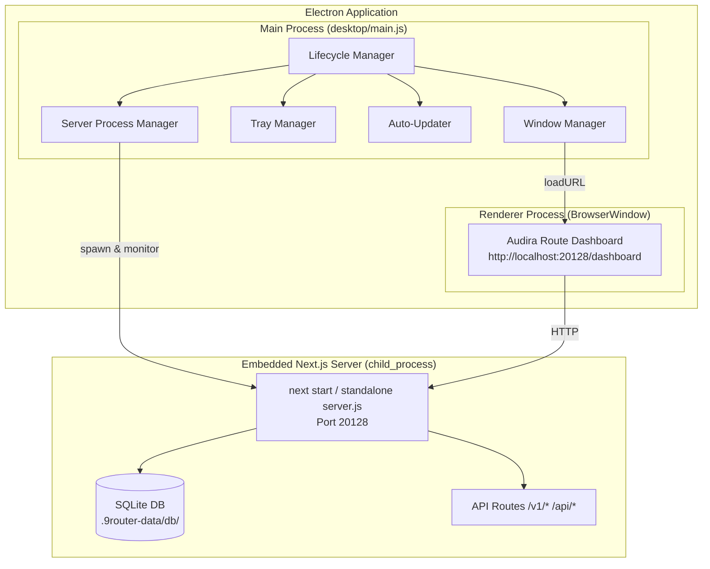
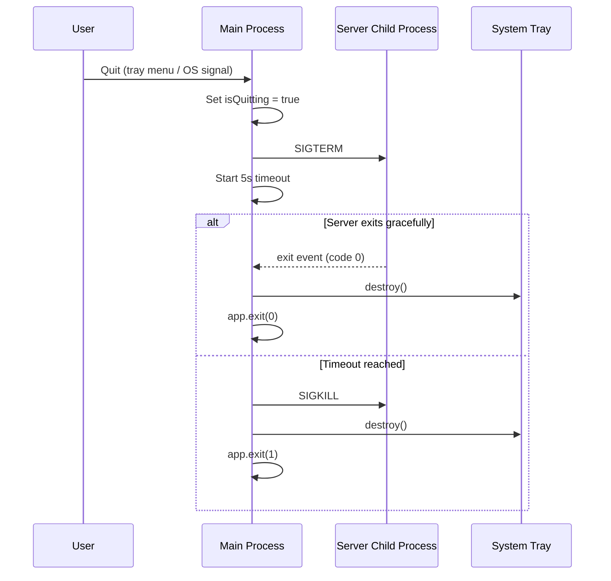

# Design Document: Desktop App

## Overview

This design describes how the Audira Route Next.js web application is packaged as a native Electron desktop application. The Electron main process manages the application lifecycle — spawning the embedded Next.js standalone server, creating a BrowserWindow that loads the dashboard, handling system tray integration, and coordinating graceful shutdown. The renderer process is simply the existing web dashboard loaded via localhost.

The architecture reuses the existing Next.js `output: "standalone"` build, the SQLite persistence layer, and the `.9router-data/` directory structure. Electron provides the native window chrome, single-instance enforcement, auto-update via `electron-updater`, and OS-level integration (tray, autostart) that replaces the current CLI-based systray2/PowerShell approach.

### Key Design Decisions

| Decision | Rationale |
|----------|-----------|
| Electron over Tauri/Neutralino | Existing codebase is Node.js-heavy (Next.js server, better-sqlite3 native module). Electron's Node.js runtime avoids a cross-language bridge. |
| Spawn server as child process | Keeps the Next.js server isolated. Crash recovery is simpler. The standalone server.js is already designed to run independently. |
| Reuse port 20128 | Maintains compatibility with existing CLI tools, API clients, and documentation. |
| electron-builder over electron-forge | electron-builder has mature NSIS/DMG/AppImage support and simpler auto-update integration with electron-updater. |
| `desktop/` directory at repo root | Keeps Electron code separate from the web app (`src/`) and CLI (`cli/`), avoiding build interference. |

## Architecture



### Process Model

1. **Main Process** — Single Node.js process running Electron. Responsibilities:
   - Spawn the Next.js server as a child process
   - Manage BrowserWindow lifecycle (create, hide, restore, close)
   - System tray icon and context menu
   - Single-instance lock enforcement
   - Auto-update checks via electron-updater
   - Window state persistence (position, size)

2. **Server Child Process** — The Next.js standalone `server.js` running on port 20128. Spawned with `child_process.fork()` or `spawn()` with the `DATA_DIR` environment variable set.

3. **Renderer Process** — The BrowserWindow loading `http://localhost:20128/dashboard`. No custom preload scripts needed since the dashboard is a standard web app communicating via HTTP APIs.

## Components and Interfaces

### 1. Server Process Manager (`desktop/src/serverManager.js`)

Responsible for starting, monitoring, and stopping the embedded Next.js server.

```typescript
interface ServerManager {
  start(): Promise<void>;        // Spawn server, resolve when ready
  stop(): Promise<void>;         // Graceful shutdown (SIGTERM + timeout)
  isRunning(): boolean;          // Health check
  onReady(cb: () => void): void; // Server ready callback
  onError(cb: (err: Error) => void): void; // Server error callback
}
```

**Startup sequence:**
1. Resolve path to `.next/standalone/server.js` within the packaged app
2. Set environment: `DATA_DIR`, `PORT=20128`, `NODE_ENV=production`
3. Spawn child process via `child_process.fork()`
4. Poll `http://localhost:20128/api/settings` until 200 response (max 30s)
5. Emit `ready` event or `error` after timeout

**Shutdown sequence:**
1. Send `SIGTERM` to child process
2. Wait up to 5 seconds for graceful exit
3. If still running, send `SIGKILL`

### 2. Window Manager (`desktop/src/windowManager.js`)

Manages the BrowserWindow instance and persists window state.

```typescript
interface WindowManager {
  createWindow(): BrowserWindow;
  show(): void;
  hide(): void;
  focus(): void;
  saveState(): void;
  restoreState(): WindowState;
}

interface WindowState {
  x: number;
  y: number;
  width: number;
  height: number;
  isMaximized: boolean;
}
```

**Window state persistence:**
- State saved to `desktop-window-state.json` in Electron's `app.getPath('userData')`
- Saved on window `resize`, `move`, and `close` events (debounced)
- Restored on window creation with validation (ensure bounds are within a visible display)

**Navigation policy:**
- Intercept `will-navigate` and `new-window` events
- URLs matching `http://localhost:20128/*` → navigate internally
- All other URLs → open in `shell.openExternal()`

### 3. Tray Manager (`desktop/src/trayManager.js`)

Manages the system tray icon and context menu using Electron's native `Tray` API.

```typescript
interface TrayManager {
  create(): void;
  destroy(): void;
  updateMenu(autoStartEnabled: boolean): void;
}
```

**Context menu items:**
| Item | Action |
|------|--------|
| Open Dashboard | `windowManager.show()` + `windowManager.focus()` |
| Auto-start (toggle) | `app.setLoginItemSettings({ openAtLogin: toggle })` |
| Quit | `serverManager.stop()` → `app.quit()` |

**Tray events:**
- Double-click → show and focus window
- Single-click (Windows) → show and focus window

### 4. Auto-Updater (`desktop/src/autoUpdater.js`)

Wraps `electron-updater` for checking and applying updates.

```typescript
interface AutoUpdateManager {
  checkForUpdates(): void;
  onUpdateAvailable(cb: (info: UpdateInfo) => void): void;
  onUpdateDownloaded(cb: (info: UpdateInfo) => void): void;
  downloadUpdate(): void;
  quitAndInstall(): void;
}
```

**Update flow:**
1. On app `ready`, call `autoUpdater.checkForUpdates()`
2. If update available → show notification with version number
3. User accepts → `autoUpdater.downloadUpdate()`
4. Download complete → show dialog: "Restart now to apply update?"
5. User confirms → `autoUpdater.quitAndInstall()`
6. Network error → silently swallow, retry on next launch

### 5. Lifecycle Manager (`desktop/main.js`)

The entry point that orchestrates all components.

```typescript
// Startup sequence
app.whenReady() →
  requestSingleInstanceLock() →
  serverManager.start() →
  windowManager.createWindow() →
  trayManager.create() →
  autoUpdater.checkForUpdates()

// Shutdown triggers
tray "Quit" → gracefulShutdown()
OS signal (SIGTERM/SIGINT) → gracefulShutdown()
app.on('before-quit') → gracefulShutdown()

// gracefulShutdown()
serverManager.stop() → app.exit(0)
```

## Data Models

### Window State (`desktop-window-state.json`)

```json
{
  "x": 100,
  "y": 100,
  "width": 1280,
  "height": 800,
  "isMaximized": false
}
```

Stored in Electron's `userData` directory (`%APPDATA%/audira-route/` on Windows, `~/Library/Application Support/audira-route/` on macOS, `~/.config/audira-route/` on Linux).

### Electron Builder Configuration (`desktop/electron-builder.yml`)

```yaml
appId: com.audira.route
productName: Audira Route
directories:
  output: dist
  buildResources: resources
files:
  - "src/**/*"
  - "node_modules/**/*"
  - "main.js"
  - "package.json"
extraResources:
  - from: "../.next/standalone"
    to: "server"
    filter: ["**/*"]
  - from: "../.next/static"
    to: "server/.next/static"
    filter: ["**/*"]
  - from: "../public"
    to: "server/public"
    filter: ["**/*"]
win:
  target: nsis
  icon: resources/icon.ico
mac:
  target: dmg
  icon: resources/icon.png
  category: public.app-category.developer-tools
linux:
  target: AppImage
  icon: resources/icon.png
  category: Development
nsis:
  oneClick: false
  allowToChangeInstallationDirectory: true
publish:
  provider: github
  owner: audira
  repo: audira-route
```

### Desktop Package Structure

```
desktop/
├── main.js                    # Electron entry point
├── package.json               # Electron-specific dependencies
├── electron-builder.yml       # Build configuration
├── resources/
│   ├── icon.ico              # Windows icon (copied from cli/src/cli/tray/)
│   ├── icon.png              # macOS/Linux icon
│   └── icon.icns             # macOS app icon
├── src/
│   ├── serverManager.js      # Next.js server lifecycle
│   ├── windowManager.js      # BrowserWindow + state persistence
│   ├── trayManager.js        # System tray integration
│   ├── autoUpdater.js        # electron-updater wrapper
│   └── utils/
│       ├── paths.js          # Path resolution (packaged vs dev)
│       └── urlClassifier.js  # Internal vs external URL routing
└── scripts/
    └── build.js              # Orchestrates next build + electron-builder
```

### Desktop `package.json`

```json
{
  "name": "audira-route-desktop",
  "version": "0.4.46",
  "description": "Audira Route Desktop Application",
  "main": "main.js",
  "scripts": {
    "start": "electron .",
    "dev": "cross-env NODE_ENV=development electron .",
    "build": "node scripts/build.js",
    "pack": "electron-builder --dir",
    "dist": "electron-builder"
  },
  "dependencies": {
    "electron-updater": "^6.3.0"
  },
  "devDependencies": {
    "electron": "^33.0.0",
    "electron-builder": "^25.0.0",
    "cross-env": "^7.0.3"
  }
}
```

### Root `package.json` additions

```json
{
  "scripts": {
    "dev:desktop": "cd desktop && npm run dev",
    "build:desktop": "cd desktop && npm run build"
  }
}
```

## Correctness Properties

*A property is a characteristic or behavior that should hold true across all valid executions of a system — essentially, a formal statement about what the system should do. Properties serve as the bridge between human-readable specifications and machine-verifiable correctness guarantees.*

### Property 1: Window state persistence round-trip

*For any* valid window bounds (x, y, width, height, isMaximized), saving the state to disk and then restoring it should produce the same bounds values, provided the bounds fall within a visible display area.

**Validates: Requirements 3.2, 3.3**

### Property 2: URL routing classification

*For any* URL string, the URL classifier should route it internally (within the BrowserWindow) if and only if it matches `http://localhost:20128/*`, and should route it externally (via shell.openExternal) for all other URLs.

**Validates: Requirements 3.5, 3.6**

### Property 3: Data directory initialization

*For any* initial filesystem state where the Data_Directory does not exist, starting the application should create the directory with all required subdirectories (db/, logs/, mitm/), and the resulting structure should be identical regardless of the platform or prior state.

**Validates: Requirements 5.2**

## Error Handling

| Scenario | Handling |
|----------|----------|
| Server fails to start (port in use) | Display error dialog: "Port 20128 is already in use. Another instance may be running." Offer retry or quit. |
| Server fails to start (timeout) | After 30s, display error dialog with last stderr output. Offer retry or quit. |
| Server crashes during operation | Detect child process `exit` event. Show notification: "Server stopped unexpectedly." Auto-restart up to 3 times, then show error dialog. |
| Window state file corrupted | Fall back to default window dimensions (1280x800, centered). Delete corrupted file. |
| Auto-update network failure | Silently catch error. Log to console. Retry on next app launch. |
| Single-instance lock denied | Focus existing instance window via IPC. Exit new instance with code 0. |
| SQLite database locked | Handled by existing server code (better-sqlite3 WAL mode). Desktop app ensures single instance. |
| Electron crashes | OS-level crash reporter. User relaunches manually. |

### Graceful Shutdown Sequence



## Testing Strategy

### Unit Tests

Unit tests cover the pure logic components using Vitest (consistent with a Node.js/JavaScript project):

- **URL classifier** — verify internal/external URL routing decisions
- **Window state serialization** — save/restore logic with edge cases (negative coords, zero dimensions, multi-monitor)
- **Data directory creation** — verify correct subdirectory structure
- **Server readiness detection** — mock HTTP polling logic
- **Graceful shutdown sequencing** — verify SIGTERM → timeout → SIGKILL flow

### Property-Based Tests

Property-based tests use `fast-check` with Vitest to verify universal properties:

- **Property 1**: Generate random window bounds → save → restore → assert equality (minimum 100 iterations)
  - Tag: `Feature: desktop-app, Property 1: Window state persistence round-trip`
- **Property 2**: Generate random URL strings (internal and external) → classify → assert correct routing (minimum 100 iterations)
  - Tag: `Feature: desktop-app, Property 2: URL routing classification`
- **Property 3**: Generate random initial directory states → initialize → assert required structure exists (minimum 100 iterations)
  - Tag: `Feature: desktop-app, Property 3: Data directory initialization`

### Integration Tests

Integration tests verify Electron-specific behavior using Playwright Electron support or Spectron:

- Application launches and displays dashboard
- Close-to-tray behavior
- Tray menu actions (open, quit)
- Single-instance enforcement
- Auto-start toggle persists across restarts

### Smoke Tests

Build verification (CI):

- `build:desktop` produces expected output files (.exe, .dmg, .AppImage)
- Package contains required resources (server/, icons, node_modules)
- Package excludes dev-only files (gitbook/, docs/, .git/)

### Test Configuration

- Property-based testing library: `fast-check`
- Test runner: `vitest`
- Minimum iterations per property test: 100
- Each property test tagged with: `Feature: desktop-app, Property {number}: {property_text}`
